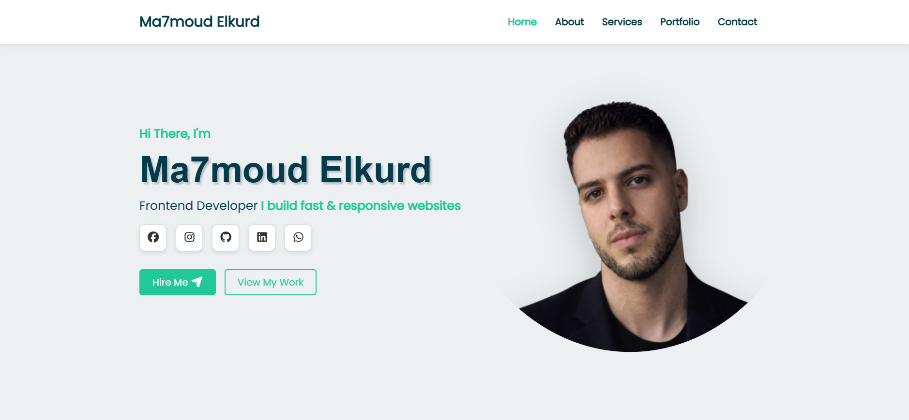

# portfolio
A modern responsive portfolio website built using HTML, CSS, and JavaScript. It showcases my skills, projects, and experience as a frontend developer with smooth animations and mobile-friendly design.
# 💼 Personal Portfolio Website

A modern responsive personal portfolio website built using HTML, CSS, and JavaScript. It showcases my skills, projects, and experience as a frontend developer with smooth animations and mobile-friendly design.

---

## 📌 Features
- Fully responsive design (mobile, tablet, desktop)
- Modern and clean UI layout
- Smooth scroll navigation
- Sections for:
  - About Me
  - Skills
  - Services
  - Portfolio
  - Contact
- Interactive UI elements and animations

---

## 🛠️ Technologies Used
- HTML5  
- CSS3  
- JavaScript (Vanilla JS)

---

## 📷 Preview

---

## 📬 Contact
You can reach me through the contact form in the website or via my social links.

---

## 🚀 Live Demo
(ضع هنا رابط موقعك على GitHub Pages)

---

Made with ❤️ by **Ma7moud Elkurd**
